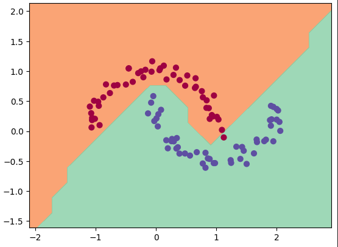

# Lil grad

Lil grad is a simple and small autograd implementation and an extension on Andrej Karpathy's [Micrograd](https://github.com/karpathy/micrograd). Instead of operating only on scalars it can also operate on Tensors. In addition to simple element-wise operations like addition, subtraction, multiplication, etc., it is also able to process matrix operations both in forward and backward operation.

## Broadcasting

Currently Lil grad is only able to process the gradients for scalars and 1 dimensional lists (for addition operations) which are broadcasted. Other broadcasted shapes will raise an error or behave improperly.

## Binary Point Classification

Similar to Micrograd's test demo, Lil grad is also capable of classifying points with a MLP approach. in the case of Lil grad, this is done via matrix multiplications of tensors instead of MLP, Layer, and Neuron objects. Similar results were achieved with this approach.

